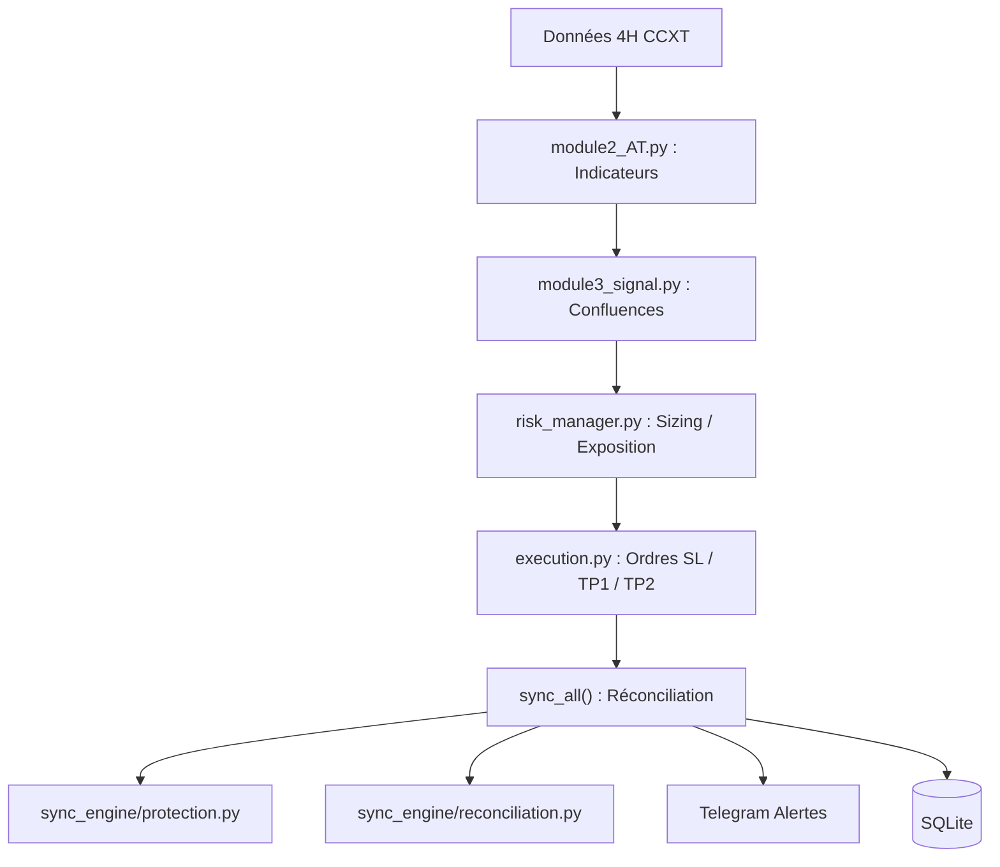

# MajeurCap_Bot


Bot de trading automatisé pour Binance Futures (perpetuals), timeframe 4H.
Génère des signaux LONG/SHORT via une logique de confluence ATR, pose les
ordres SL + TP1 + TP2 directement sur l'exchange, et gère les positions via
une boucle de réconciliation continue (`sync_all()`).

Développé avec CCXT (`ccxt.async_support`), SQLite pour la persistance, et
Telegram pour les alertes et le contrôle à distance.

---

## 🚀 Quick Start

```bash
# 1. Cloner
git clone https://github.com/issa14/MajeurCap_Bot.git
cd MajeurCap_Bot

# 2. Installer les dépendances
python -m venv env && source env/bin/activate
pip install -r requirements.txt

# 3. Configurer
cp config.yaml.example config.yaml
# Éditer config.yaml → remplir api_key, api_secret, telegram_token

# 4. Lancer
python main.py
```

---

## ⚙️ Configuration

Fichier `config.yaml` — paramètres clés :

| Paramètre | Valeur | Description |
|-----------|--------|-------------|
| `watchlist` | 8 paires USDT | BTC, ETH, HYPE, SUI, LINK, BNB, SOL, VET |
| `timeframe` | `4h` | Bougie 4 heures |
| `min_confluences` | `4` | Confluences techniques minimum pour entrée |
| `sl_atr_mult` | `1.0` | Stop-loss = 1.0× ATR |
| `tp1_rr` | `1.2` | Take-profit 1 = 1.2R |
| `tp2_rr` | `2.0` | Take-profit 2 = 2.0R |
| `leverage` | `5` | Levier ×5 |
| `max_positions` | `5` | Positions simultanées max |
| `max_exposure` | `30%` | Exposition max (cible recommandée : 250%) |
| `trailing_sl_enabled` | `false` | Désactivé définitivement |
| `enable_demo_trading` | — | Testnet Binance Futures |

---

## 🧠 Stratégie

Signaux générés par confluence d'indicateurs techniques (EMA, RSI, ADX, ZigZag,
Keltner Channels, volume). Chaque indicateur actif compte pour 1 confluence.

- **Score pondéré** : utilisé uniquement pour choisir LONG vs SHORT — jamais
  comme seuil d'entrée (sous-performe le comptage brut).
- **Stop-loss** : 1.0× ATR, fixe — **pas de trailing SL** (éliminé après
  backtest : Sharpe passe de 1.83 à 0.31 avec trailing).
- **Take-profits** : TP1 à 1.2R (fermeture 50%), TP2 à 2.0R (fermeture 50%).

---

## 📊 Backtest

Résultats out-of-sample (walk-forward) — configuration actuelle :

| Configuration | Sharpe | PF | Winrate | Max DD |
|---------------|--------|-----|---------|--------|
| 4 confluences, SL 1.0×ATR | **0.83** | 1.71 | ~45% | — |
| Avec trailing SL | 0.31 | — | — | — |
| 3 confluences (ancien) | ~0.28 | — | — | — |

> `min_confluences: 4` est le changement de config le plus impactant validé
> à ce jour (robustesse ×3 par rapport à 3 confluences).

---

## 🛡️ Risk Management

- **Position sizing** : fraction du capital par trade, calculé par `risk_manager.py`
- **Stop-loss** : 1.0× ATR, placé directement sur l'exchange (ordre stop-market)
- **Circuit breaker SL/TP** : cooldown temporel 15 min après 3 échecs consécutifs
  de recréation d'ordre — remplace un ancien blocage permanent (bug deadlock BNB/USDT)
- **Réconciliation continue** : `sync_all()` détecte et répare les divergences
  DB↔Binance (positions fermées, quantités incorrectes, ordres SL/TP manquants)
- **Pas de fermeture aveugle** : les positions disparues sans historique sont
  marquées `UNRESOLVED` pour review manuelle

---

## 🧪 Tests

```bash
pytest tests/ -v
```

**32 tests** couvrant :
- `exchange/` : normalisation ccxt (bugs `triggerPrice` absent, collapse `stop_market`)
- `risk/` : circuit breaker (cooldown, expiration, ré-alerte)
- `sync_engine/` : protection (recréation SL/TP mockée), reconciliation (Tier 1 + Tier 2)

---

## 🏗️ Architecture



```
majeurcap/
├── trade_manager.py       # Orchestration : sync_all(), gestion des positions
├── execution.py           # Exécution des signaux, mise à jour des ordres SL
├── database.py            # Accès SQLite
├── config_loader.py       # Chargement de la config YAML
├── risk_manager.py         # Sizing, exposition
├── bot_telegram.py / bot_listener.py   # Alertes et commandes Telegram
├── dashboard_api.py / dashboard.html   # Dashboard de suivi
│
├── core/                  # Types et exceptions partagés
│   ├── types.py            # ExchangeOrder (utilisé) ; Position/Signal/
│   │                        # OrderIntent (définis, pas encore branchés — voir
│   │                        # "Reste à faire")
│   └── exceptions.py
│
├── exchange/               # Seul point de contact avec ccxt
│   ├── normalize.py         # get_stop_price(), get_raw_order_type() —
│   │                        # corrige les incohérences triggerPrice/stopPrice
│   │                        # et le collapse stop_market/take_profit_market → market
│   └── gateway.py           # ExchangeGateway (testé, pas encore branché dans
│                             # le chemin d'exécution live — voir "Reste à faire")
│
├── risk/
│   └── circuit_breaker.py   # Circuit breaker SL/TP à cooldown temporel
│                             # (remplace un ancien blocage permanent)
│
├── sync_engine/            # Logique de synchronisation extraite de sync_all()
│   ├── protection.py        # Recréation des ordres SL/TP manquants
│   ├── reconciliation.py    # Recherche des ordres existants (par ID puis par prix)
│   └── constants.py
│
└── tests/                  # Tests unitaires (exchange, circuit breaker, sync_engine)

```

## 📋 État du refactoring

`sync_all()` faisait ~590 lignes avant refactoring (une fonction unique
mélangeant appels ccxt, matching d'ordres, circuit breaker et alertes). Elle
fait aujourd'hui ~148 lignes — orchestration pure, la logique métier vit dans
des fonctions nommées et testées.

### ✅ Fait

- **`exchange/`** : bugs ccxt corrigés et couverts par tests — `triggerPrice`
  absent (fallback `stopPrice`/`info.stopPrice`), et le collapse de
  `stop_market`/`take_profit_market` en `"market"` sur les marchés futures.
- **`risk/circuit_breaker.py`** : le circuit breaker SL/TP se bloquait
  définitivement une fois le seuil d'échecs atteint (le reset ne pouvait
  survenir que sur succès de recréation, lui-même bloqué). Remplacé par un
  cooldown temporel (15 min) avec sortie garantie et ré-alerte périodique.
- **`sync_engine/protection.py`** et **`reconciliation.py`** : logique de
  recréation et de recherche d'ordres extraite de `sync_all()`, avec tests
  utilisant un exchange mocké.
- **Découpe complète de `sync_all()`** : les 4 cas (position absente de
  Binance, divergence DB↔Binance, réconciliation SL/TP, positions orphelines)
  sont désormais des fonctions isolées et testables.

### 🔲 Reste à faire

- **Déplacer les 3 fonctions encore dans `trade_manager.py`**
  vers `sync_engine/`, pour cohérence avec le Cas C déjà déplacé.
- **`core/types.py`** : `Position`, `Signal`, `OrderIntent` définis mais non
  utilisés — migration dicts → types explicites pas encore commencée.
- **`ExchangeGateway`** : défini et testé, mais `sync_engine/` et
  `trade_manager.py` appellent encore ccxt directement.
- **`config/schema.py` en Pydantic** : jamais commencé.
- **`max_exposure`** : 250% identifié comme cible, config actuelle à 30%.
- **Nettoyage ordres orphelins** `BNB/USDT:USDT` sur testnet (quota `-4045`).
- **Déploiement Oracle Cloud** avec `systemd`.
- **Heartbeat Telegram** périodique (4-6h) — conçu, pas implémenté.

---

## 📝 Journal des modifications

| Date | Changement | Impact |
|------|-----------|--------|
| 2026-07 | Refactoring `sync_all()` : 590→148 lignes, 9 étapes | Maintenabilité, testabilité |
| 2026-07 | Circuit breaker SL/TP : deadlock → cooldown temporel | Correction bug production BNB/USDT |
| 2026-07 | `exchange/normalize.py` : correction bugs ccxt 4.5.64 | Fiabilité ordres stop |
| 2026-06 | `min_confluences` : 3→4 | Sharpe ×3 (0.28→0.83) |
| 2026-06 | Trailing SL éliminé définitivement | Sharpe 1.83 sans, 0.31 avec |

---

## ⚠️ Disclaimer

**Ce bot est en phase de test sur Binance Futures Demo (testnet). Aucun capital
réel n'est engagé.** Les performances passées en backtest ne garantissent pas
les résultats futurs. Le trading de crypto-monnaies comporte un risque de perte
totale du capital. Utilisez ce logiciel à vos propres risques.

---

## 📄 License

MIT License — voir [LICENSE](LICENSE).

